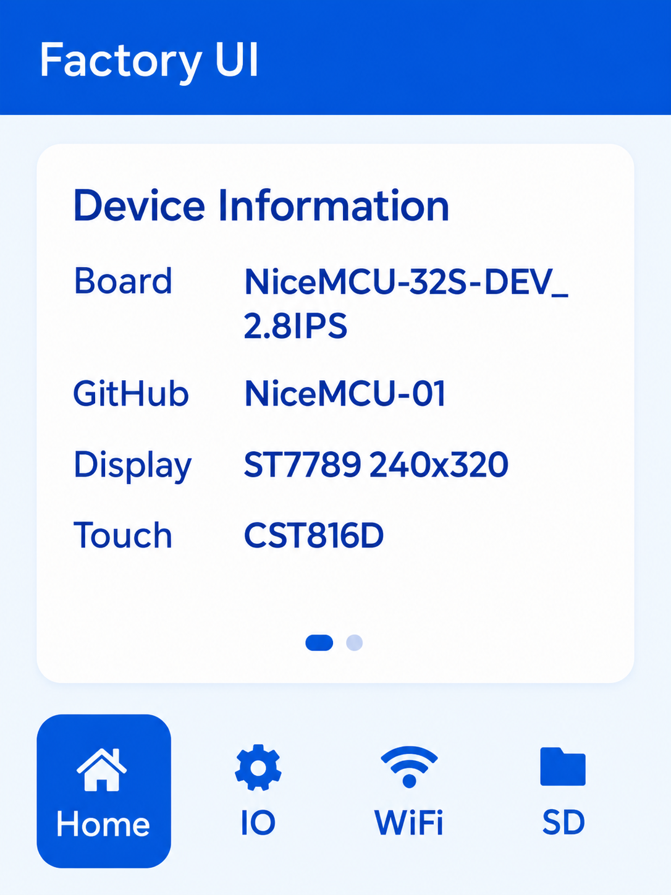

# NiceMCU 2.8 IPS Factory UI

English version: [README_EN.md](./README_EN.md)

面向 `NiceMCU-32S-DEV_2.8IPS` 开发板的 ESP32 + LVGL 显示框架与 Factory UI 示例项目。项目使用 PlatformIO 构建，配置文件为 `platformio.ini`。

## 界面预览

## 功能

- 提供基于 LVGL 的 Factory UI 示例
- 包含 Home、IO、WiFi、SD 四个页面入口
- 支持横向分页与页码指示
- 提供 ST7789 显示与 CST816D 触摸适配

## 硬件与软件栈

- 开发板：NiceMCU-32S-DEV_2.8IPS
- MCU：ESP32
- 显示屏：ST7789，240 × 320
- 触摸芯片：CST816D
- GUI 框架：LVGL 9.5.0
- 开发环境：PlatformIO（Arduino 框架）

## 项目定位

本项目提供一个可运行的 ESP32 TFT 显示框架，以及可继续扩展的 Factory UI 原型。

当前重点是显示与触摸链路、页面结构和主题样式；`IO / WiFi / SD` 页面暂不包含完整业务功能。

项目适合作为出厂默认 UI 或显示框架的参考实现，也可作为后续功能开发的界面基础。

## 界面说明

`Factory UI` 采用三段式布局：

- 顶部：蓝色标题栏，显示 `Factory UI`
- 中部：白色圆角信息卡片，支持左右滑动分页
- 底部：固定四个入口按钮 `Home / IO / WiFi / SD`

四个入口均复用同一套横向分页卡片框架。切换入口时会回到对应页面的第一页，卡片底部以圆点指示当前分页位置。

## 说明与限制

当前 `Home / IO / WiFi / SD` 页面中展示的字段均为演示或占位数据，主要用于验证：

- 验证页面布局
- 验证分页交互
- 验证字段密度、截断和留白
- 验证整体显示框架是否稳定

这些内容**不代表实际运行时的硬件状态**，也**尚未接入实时板级数据**。可根据具体需求替换为真实状态或检测结果。

## 项目结构

- `src/main.cpp`：应用入口、LVGL tick 与 UI 启动
- `src/nicemcu_display.cpp`：ST7789、CST816D、LVGL 显示与触摸适配
- `src/factory_ui.cpp`：Factory UI 主界面结构、分页逻辑与 tab 切换
- `include/factory_ui/`：UI 头文件，包含 app、styles、theme 的接口声明
- `include/nicemcu/`：NiceMCU 驱动接口与目标硬件参数

## 显示与触摸驱动

项目针对该开发板提供独立的最小显示与触摸驱动实现，便于在清理 `.pio`、重新安装依赖或迁移开发环境后复现。

- 显示与触摸驱动：`src/nicemcu_display.cpp`
- 硬件参数：`include/nicemcu/board_config.h`
- UI 框架：PlatformIO 管理的 `lvgl/lvgl`

## 许可证

本项目采用 [MIT License](./LICENSE)。
